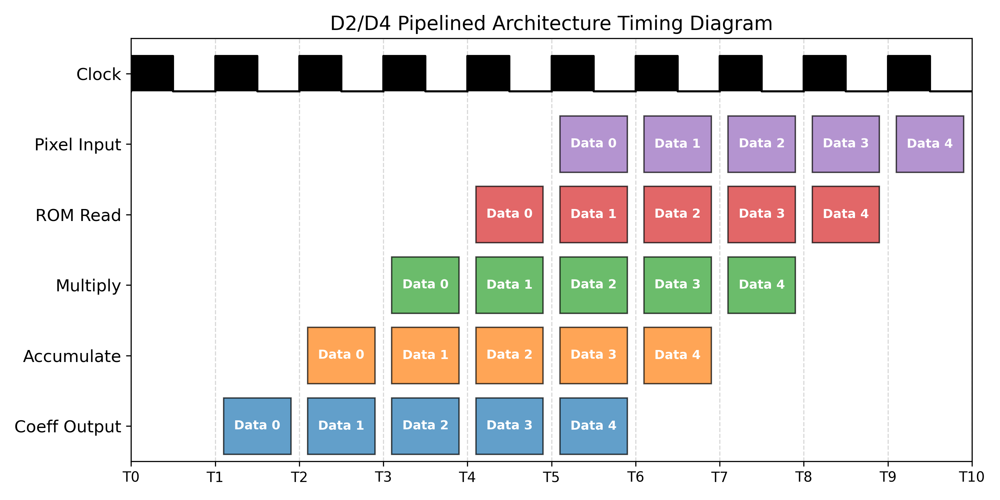

# Architecture

The 2D DCT accelerator uses the row-column decomposition method. This allows the 2D transform to be computed as two successive 1D transforms.

## Block Diagram

*(SVG Block Diagram will be inserted here)*

## Module Breakdown

1. **Pixel Block Buffer:** Ingests raw 8x8 pixel blocks from the input.
2. **Row 1D DCT Engine:** Performs the transform across rows.
3. **Transpose Buffer:** Rotates the intermediate 8x8 block to transpose columns into rows.
4. **Column 1D DCT Engine:** Performs the transform across the newly transposed rows (original columns).
5. **Quantizer:** Applies the JPEG Quantization matrix to selectively discard high frequencies.
6. **Output Buffer:** Stores the final quantized coefficients.

## Pipelining and Timing

*Waveform diagram illustrating the pipeline stages and data flow through the architecture.*
