# Comprehensive Image Gallery

This gallery serves as a centralized collection of all visualizations, charts, and hardware screenshots generated for the 2D DCT Accelerator project.

## 1. Visual Reconstruction

### Reconstructed Image Output
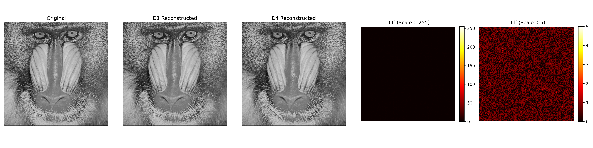
*Side-by-side comparison of the original image and the RTL reconstructed output for D1 and D4, alongside heatmaps of the absolute error.*

## 2. Error and Fidelity Analysis

### Error Histogram
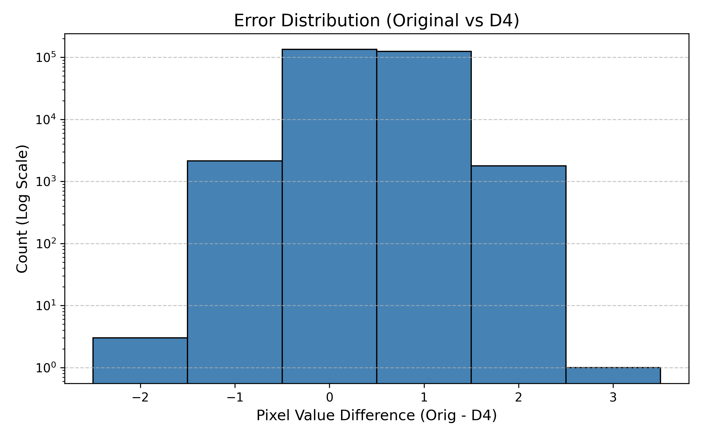
*Distribution of pixel-wise errors between the original image and the D4 reconstructed output.*

### 2D DCT Energy Concentration
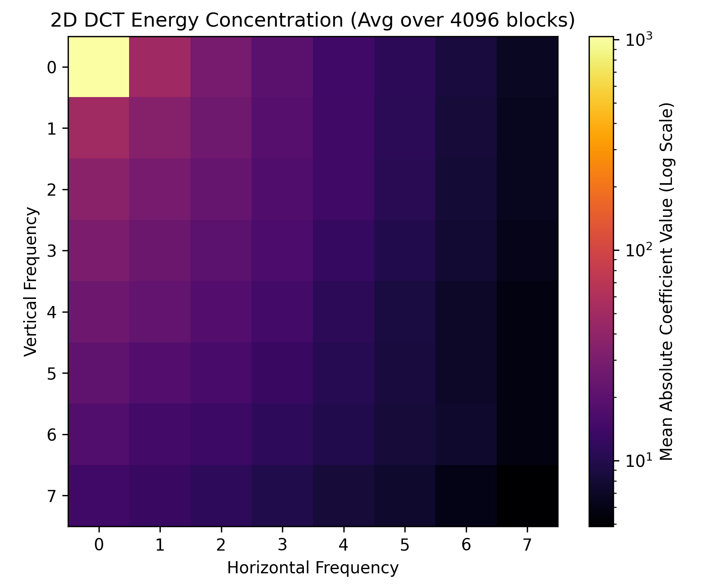
*Heatmap showing the concentration of signal energy in the low-frequency DCT coefficients.*

### PSNR vs Quantization Factor
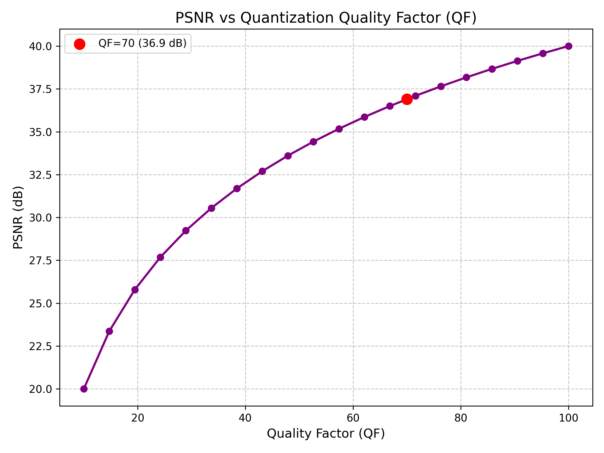
*Relationship between the JPEG Quantization Quality Factor and the resulting Peak Signal-to-Noise Ratio (PSNR).*

## 3. Hardware & Performance Metrics

### Throughput Comparison
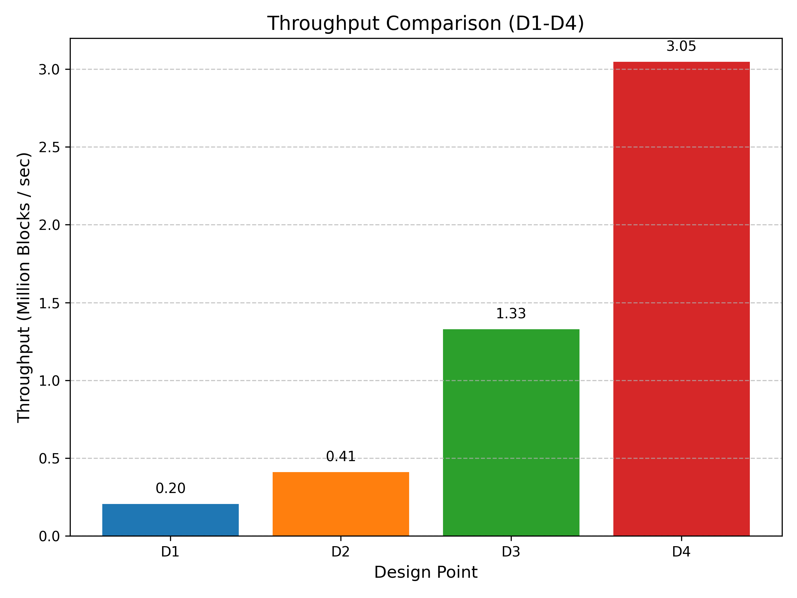
*Bar chart comparing the raw throughput (in Million Blocks / sec) across the four design variants.*

### Hardware Resource Breakdown
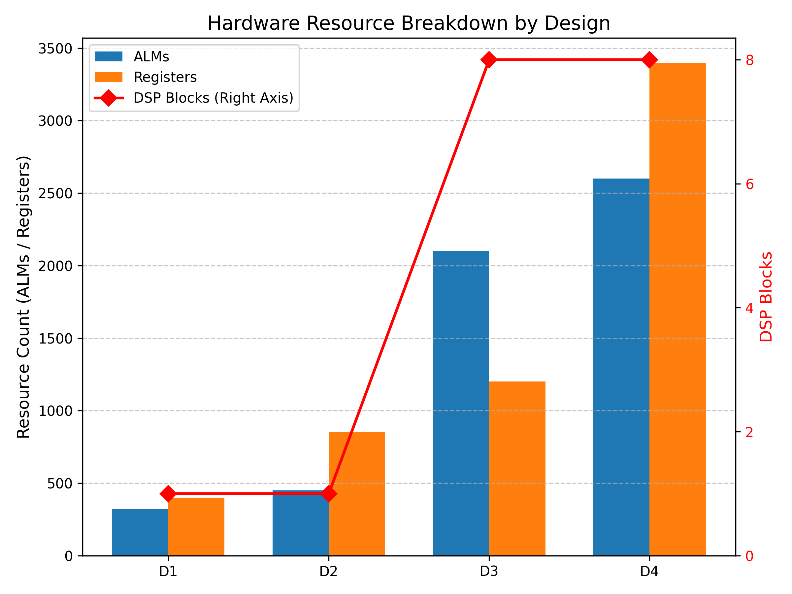
*Detailed resource breakdown across the four design variants, highlighting ALMs, Registers, and DSP block usage.*

### Area-Throughput Trade-off
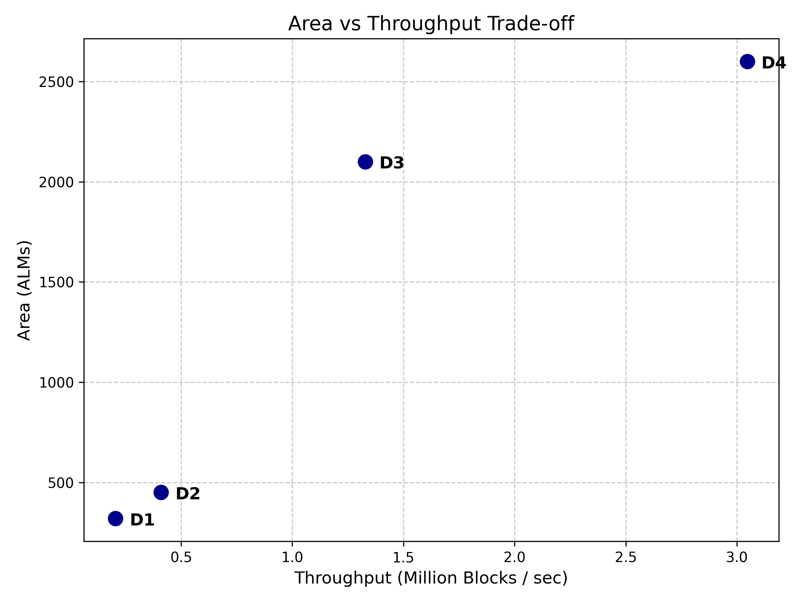
*Scatter plot illustrating the Pareto frontier of area vs. throughput for the implemented architectures.*

### Area Efficiency
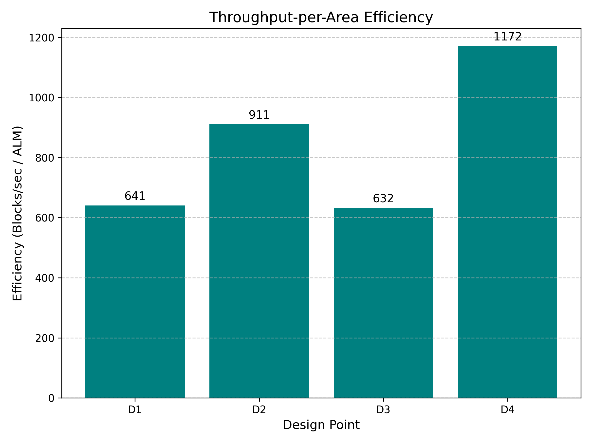
*Throughput-per-Area efficiency (Blocks/sec per ALM) showing the relative utilization effectiveness of each design.*

## 4. Architecture & Timing

### Pipeline Waveform

*Waveform diagram illustrating the pipeline stages and data flow through the architecture.*

### System Block Diagram
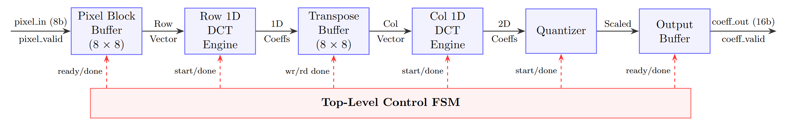
*Top-level module hierarchy and system block diagram.*

### MAC Unit Schematic
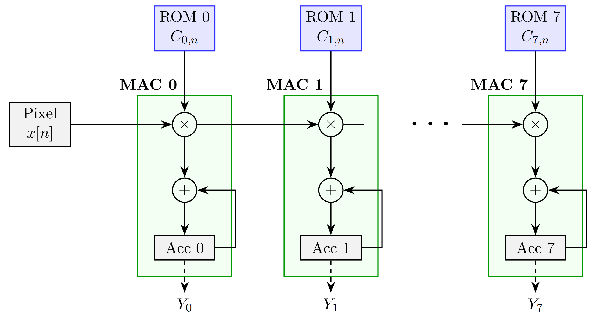
*Logic schematic for the Multiply-Accumulate (MAC) unit used in the parallel 1D engine.*

## 5. RTL Synthesis Artifacts

*The following images are placeholders for screenshots to be manually captured from the Intel Quartus GUI and placed into the `docs/figures/` directory.*

### D1: Baseline RTL Schematic
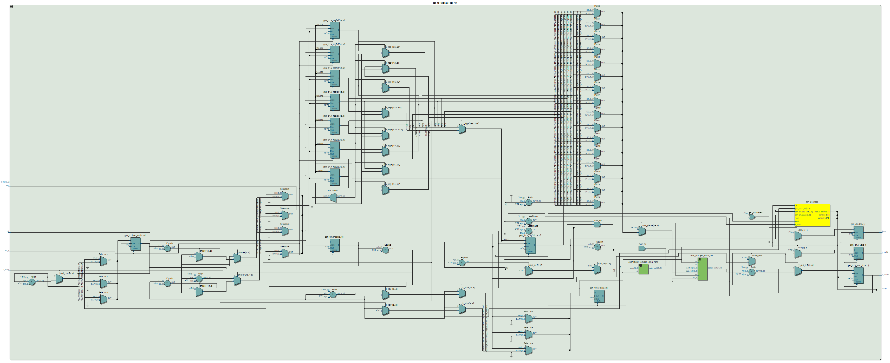

### D2: Pipelined RTL Schematic
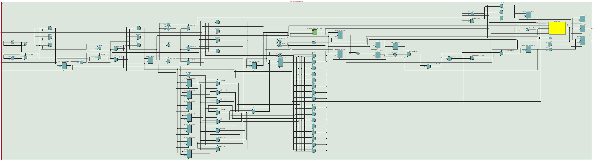

### D3: Parallel RTL Schematic
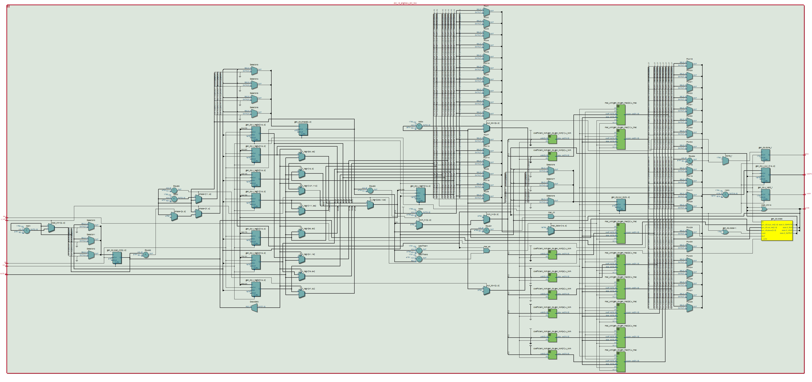

### D4: Pipelined + Parallel RTL Schematic
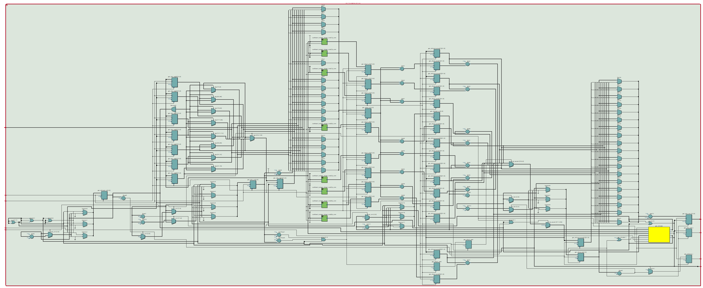

### DSP Block Inference (D1/D2)
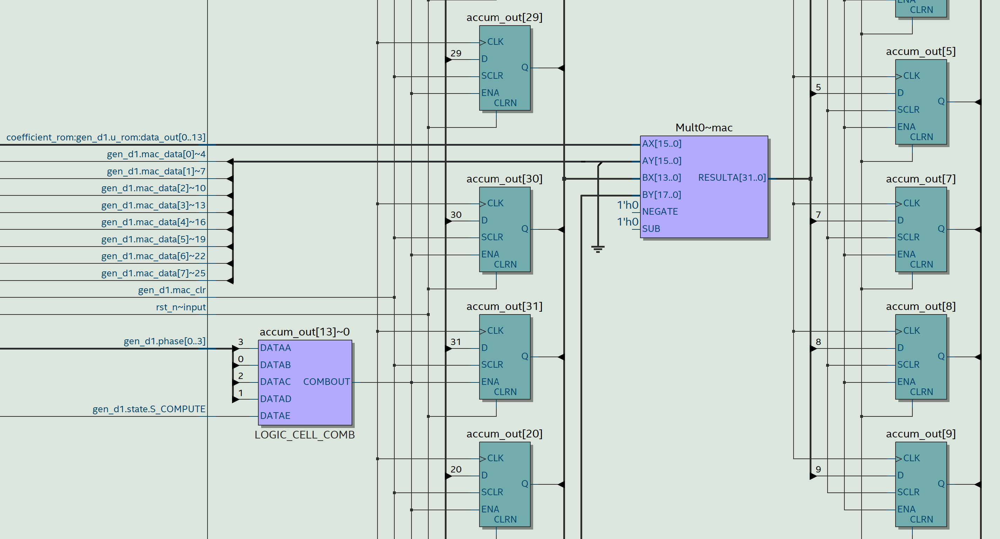

### Parallel DSP Block Inference (D3/D4)
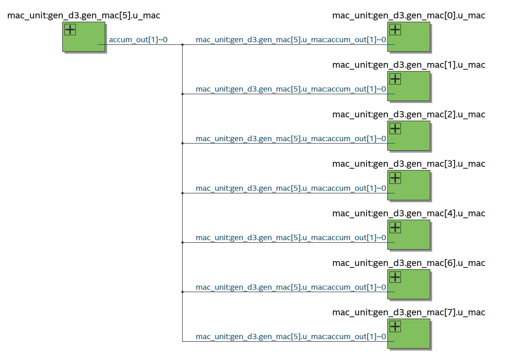
